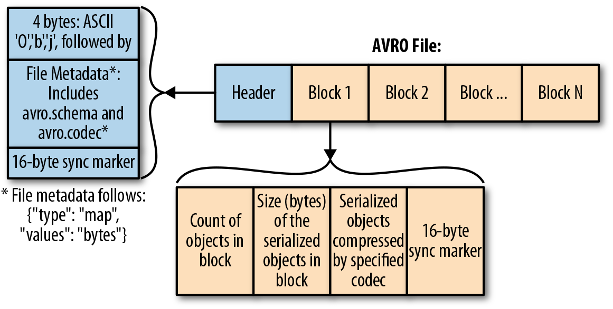

# Avro

Avro is a row-based storage format which is widely used as a serialization platform. Avro stores its schema in JSON format making it easy to read and interpret by any program. The data itself is kept in a binary format for a more efficient and compact storage.

Compared to column-based file formats like ORC and Parquet which are more suited for reader heavy use cases, Avro is better suited for heavy writer applications.

Kafka works with binary data, it accepts bytes as input from Producers and publishes them to be consumed, it does not really understand the data it processes or provide any validation, nonetheless, producers and consumers need to agree on a specific data format for any meaningful exchange of information.

Some of the popular data formats are CSV, JSON, Avro, Protocol Buffers among others, CVS files tends to be difficult to query, flat (does not support hierarchy) and consumes more disk space. JSON also tends to inefficient as it repeats every field name with every single record. Avro and Protobuf on the other hand use binary format for speed and efficiency, this guide will focus on how to use Avro streaming data with Kafka.

## Why Avro

Avro seems to be the preferred format when working with Kafka for a number of reasons:

1. Avro is very compact compared to text based formats like CSV and JSON
2. Fast Serialization
3. Good support by many programming languages including Java
4. Data is fully typed
5. It has a rich, extensible schema language defined in JSON
6. It has a good notion of compatibility for evolving data over time
7. Documentation is embedded in the schema

## Avro File Format

Avro uses JSON to define data types and structure and serializes data in a compact binary format, the figure below shows the internal data structure of an Avro file.


[Avro File Format - *Diagram from O'reilly*](https://www.oreilly.com/library/view/operationalizing-the-data/9781492049517/ch04.html#fig_3_the_avro_file_format)

## Avro Schema

The Avro schema is created in JavaScript Object Notation (JSON) document format and describes the following details

- Type of file (record by default)
- Name of the record
- Fields in the record with their corresponding data types

The following example shows a schema, which defines a document, under the name space `duke-energy.com`, with name `Employee`, having fields `first_name`, `last_name`, `age`, `exempt` and `phone_number`.

```JSON
{
  "type": "record",
  "namespace": "duke-energy.com",
  "name": "Employee",
  "fields": [
    {
      "name": "first_name",
      "type": "string",
      "doc": "First Name of Employee"
    },
    {
      "name": "last_name",
      "type": "string",
      "doc": "Last Name of Employee"
    },
    {
      "name": "age",
      "type": "int",
      "doc": "Age at the time of registration"
    },
    {
      "name": "exempt",
      "type": "boolean",
      "default": true,
      "doc": "Exempt employees are not entitled to overtime pay"
    },
    {
      "name": "phone_number",
      "type": "string",
      "default": "000-000-0000",
      "doc": "Employees Phone Number"
    }
  ]
}

```

### Primitive Data Types

Avro schema have primitive data types as well as complex data types. The following table describes the primitive data types supported by Avro

Data type | Description
----------|------------
null | Null is a type having no value.
int | 32-bit signed integer.
long | 64-bit signed integer.
float | single precision (32-bit) IEEE 754 floating-point number.
double | double precision (64-bit) IEEE 754 floating-point number.
bytes | sequence of 8-bit unsigned bytes.
string | Unicode character sequence.

### Complex Data Types of Avro
