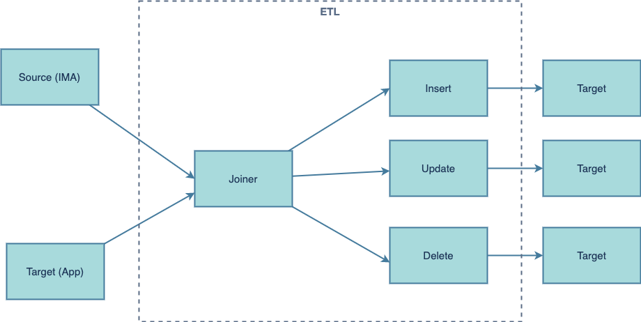

# Initial Data Load using Kafka

In a typical Microservices architecture, business applications consume data streamed into various Kafka topics, however it is often the case that these apps would initially need to replicate a specific master data set, for example, a mailer application would need a complete set of employees to seed its local employee table.

There are few ways to replicate an initial data set: an ETL application, replay all streamed data from the source into a Kafka topic, and create a new topic specific for initialization.

## ETL Application

A simple application can be created to compare source and target data sets and create a pattern to insert, update or delete target records after comparing with source. Once replication is complete, the target system can start consuming events from the related Kafka topic, the target system should be able to gracefully handle duplicate events that might have been loaded during the initial load process.

## Replay Source Data Set

To replicate the initial data set, one can replay all events from the source database to the main kafka topic, however this approach is not recommended as it requires that other consumers are able to handle the extra traffic gracefully.

## Replication Topic or Custom State Store

A specific replication topic or Custom State Store can be created for the purpose of seeding the target set, this option is recommended if you have a large data set that needs to be replicated.
