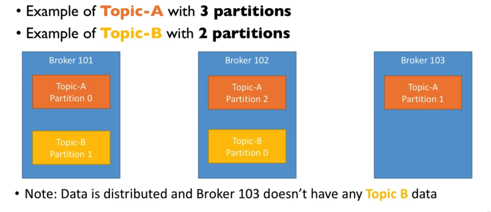
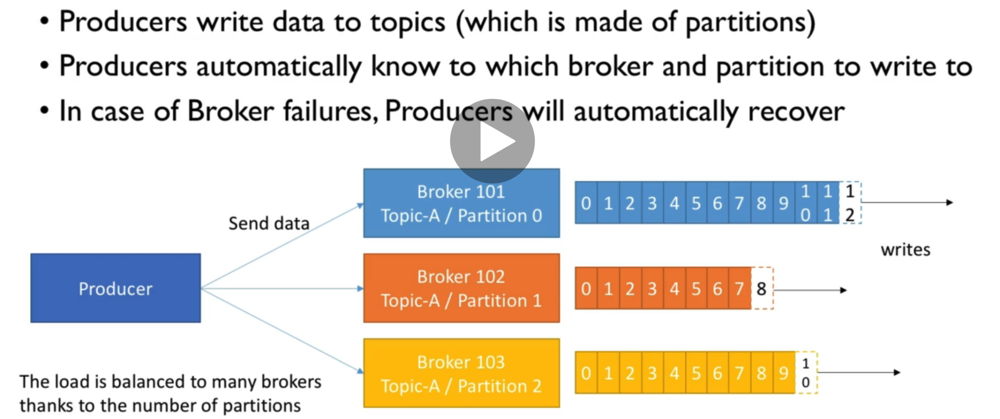
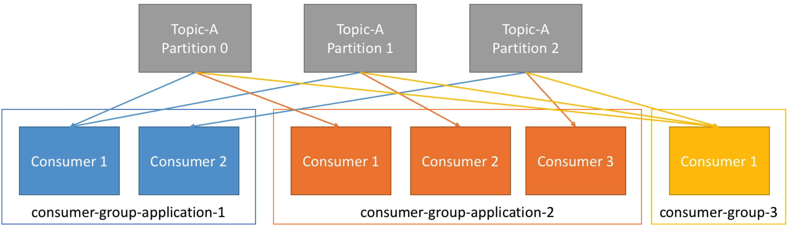

# Kafka

The main purpose of Kafka is to decouple source and target systems so that we simplify integrations

## Kafka Use Cases

- Messaging
- Activity Tracking
- Metrics & Log Gathering
- Stream Processing (Stream API or Spark)
- Decouple Systems
- Integration with Spark, Flink, Storm, Hadoop and other Big Data technologies.

## Essentials

- a Kafka Topic is split into **Partitions** (0, 1, 2 ...etc)
- Each Partition is Ordered
- Each message in a Partition gets an incremental id, called offset.
- Offset has a meaning within a Partition
- Order is guaranteed only within a Partition
- Data is kept for a limited time (default 1 week)
- **Once a data is written to a partition, it cannot be changed. (Immutability)**
- Data is assigned randomly to a partition unless a key is provided.

### Brokers

- A Kafka cluster is composed of multiple brokers (servers)
- Each broker is identified with its Id (integer)
- Each broker contains certain topic partitions
- After connecting to any broker (called bootstrap broker), you will be connected to the entire cluster

#### Brokers and Topics

- At any time, only ONE broker can be the leader for a given partition, only that leader can receive and serve data for a partition.
- Therefore, each partition has one leader and multiple ISR (In-Sync replica)

### Producers

Producers can choose to receive acknowledgement of data writes

1. acks=0, Producer won't wait for acknowledgement
2. acks=1 (default), Producer will wait for the leader to acknowledge
3. acks=all, Leader and replica acknowledge

Producers can choose to send a **key** with the message

- if key is not sent, data is sent round robin to the brokers
- if a key is sent, then all messages for that key will always go to the same partition (we get this guarantee thanks to key hashing which depends on the number of partition)
- a key is sent when we need message ordering for a specific field

### Consumers and Consumer Groups

- Consumers read data in consumer groups
- Each consumer within a group reads data from an exclusive partition
- if you have more consumers than partitions, some will be inactive

#### Consumer Offsets

- Kafka stores the offsets at which a consumer group has been reading
- The offsets are committed live in a kafka topic name __consumer_offsets
- When a consumer has processed data received from kafka, it should be committing the offsets
- if a consumer dies, it will be able to read back from where it left off

#### Delivery Semantics for consumers

Consumers choose when to commit offsets, so there are 3 delivery semantics:

1. At Most Once: offsets are committed as soon as the message is received, if processing goes wrong, the message will be lost.
2. At least Once: offsets are committed after the message is processed, if processing goes wrong, the message will be read again. Make sure your processing is idempotent.
3. Exactly Once: Can be achieved for Kafka to Kafka workflows using Kafka Streams API

## Kafka Broker Discovery

Each broker knows about all brokers, topics and partitions (metadata), you need to connect to only one broker and the client is smart enough to work with the entire cluster

## Zookeeper

- Manages brokers and help performs leader election
- Zookeeper by design operates with an odd number of servers (3, 5, 7)
- has a leader that handles writes, the rest of the servers are followers (handle reads)

## Kafka Guarantees

- Messages are appended to a topic-partition in the order they are sent
- Consumers read messages in the order stored in a topic partition
- with a replication factor of N, produces and consumers can tolerate up to N-1 brokers being down.
- **As long as the number of partitions remains constant for a topic (no new partitions), the same key will always go to the same partition**.
