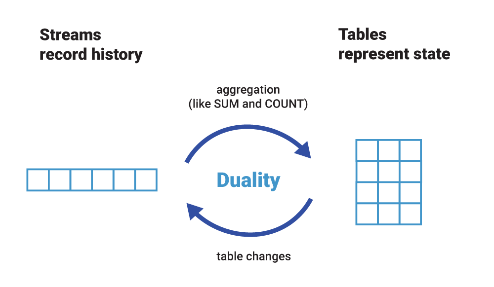

# State Stores and KTables

> Information & illustrations in this summary were captured from the official confluent documentation [website](https://docs.confluent.io/platform/current/streams/index.html)

Streaming applications transform input Kafka topics into output topics, calls external services or updates target data stores. Kafka Streams is a library that facilitates these tasks in a distributed and fault-tolerant way.

In Kafka Streams the state of the application is split across many distributed instances of the application, and across many state stores that are managed locally by these application instances.

## State

Some streaming applications are stateless, which means the processing of a message is independent from the processing of other messages. Many applications, however, require state. An application needs to maintain a state when it performs operations like join or aggregate.

Kafka Streams provides a so-called state stores, those can be used to store and query data. The [Kafka Streams DSL](https://docs.confluent.io/platform/current/streams/developer-guide/dsl-api.html), for example, automatically creates and manages such state stores when you are calling stateful operators such as `count()` or `aggregate()`, or when you are windowing a stream.

> Windowing operates by placing information into smaller chunks or categories based on time.

A Kafka Streams application is typically running on many application instances. Because Kafka Streams partitions the data for processing, an application’s entire state is spread across the local state stores of the application’s running instances.

### Local state

An application instance can query the locally managed portion of the state and directly query its own local state stores. Querying state stores is always read-only to guarantee that the underlying state stores will never be mutated out-of-band (e.g., you cannot add new entries). State stores should only be mutated by the corresponding processor topology and the input data it operates on.

Every stream [Task](https://docs.confluent.io/platform/current/streams/architecture.html#stream-partitions-and-tasks) in a Kafka Streams application may embed one or more local state stores that can be accessed via APIs to store and query data required for processing. These state stores can either be a [RocksDB](https://rocksdb.org/) database, an in-memory hash map, or another convenient data structure. Kafka Streams offers fault-tolerance and automatic recovery for local state stores.

Kafka Streams makes sure that the local state stores are robust to failures, too. For each state store, it maintains a replicated changelog Kafka topic in which it tracks any state updates. These changelog topics are partitioned as well so that each local state store instance, and hence the task accessing the store, has its own dedicated changelog topic partition.

[Log compaction](https://docs.confluent.io/platform/current/kafka/design.html#log-compaction) is enabled on the changelog topics so that old data can be purged safely to prevent the topics from growing indefinitely. If tasks run on a machine that fails and are restarted on another machine, Kafka Streams guarantees to restore their associated state stores to the content before the failure by replaying the corresponding changelog topics prior to resuming the processing on the newly started tasks. As a result, failure handling is completely transparent to the end user.

### Remote state

To query the full state of your application, you must connect the various fragments of the state, including query local state stores and discover all running instances of your application in the network and their state stores.


### Optimizing State Stores

- Use tombstone records to manage the size of state stores and make sure they do not keep growing
- Use tombstones for both soft and hard deletes
- Eliminate downstream joins by doing minor joins in pre-processing steps
- Eliminate re-keying downstream by doing it in pre-processing steps
- For a stream processing instance, memory and storage are the key characteristics; CPU is not; so, choose an instance (and volume) that is optimized for memory and storage
- Use Java 11 instead of Java 8, because it is container-aware in terms of resource consumption
- Allocate extra memory in app's "pod/container" outside of what's allocated to JVM; this is to provide room to Rocks DB to exceed JVM memory limit

## KTable

Streams and Tables in Kafka have few differences mainly with regard to the ability to change their contents. A stream provides immutable data. It supports only inserting (appending) new events, whereas existing events cannot be changed. A table, on the other hand, provides mutable data. New rows can be inserted, and existing rows can be updated and deleted.

> In this context the term Table refers to the KTable construct provided by Kafka Streams

A table in Kafka is more like an RDBMS materialized view than an RDBMS table, because it relies on a change being made elsewhere rather than being directly updatable itself. Seen through the lens of event streaming however, a table is also an aggregated stream

A stream can be converted into a table by aggregating the stream with operations like `count` or `sum`, we can also turn a table into a stream by capturing and re-playing its change log.



### Tables are partitioned

Similar to Streams, Tables are partitioned, however, tables need to additionally maintain their respective state in between events so that operations like aggregations can work properly. This is achieved by implementing tables on top of state stores, which are essentially lightweight key-value databases.

Every table has its own state store. Any operation on the table such as querying, inserting, or updating a row is carried out behind the scenes by a corresponding operation on the table’s state store. These state stores are being materialized on local disk inside your application instances or ksqlDB servers for quick access.

State stores are stored remotely in Kafka to enable fault tolerance and elasticity. That is, Kafka is the source of truth for table data, just like for streams. The aforementioned local materialization of tables, which uses embedded RocksDB as the default engine, is immaterial for the “safety” of your data.

You may wonder at this point what the difference is between a table and a state store. Firstly, every table generally has a state store but not vice versa. Developers writing Kafka Streams applications can use the Processor API to create and interact with the lower-level state stores directly without having to use tables at all. If you are using ksqlDB, however, you will never see state stores as they are an implementation detail. Secondly, as discussed previously, one cannot mutate a table directly today, which makes it similar to an RDBMS materialized view. State stores differ in that they give developers direct read and write access through typical operations, such as put(key, value) or get(key) for querying, inserting, updating, and deleting data.

### Global Tables

Global KTable is an abstraction of a changelog stream from a primary-keyed table. Each record in this changelog stream is an update on the primary-keyed table with the record key as the primary key.
Global KTable can only be used as right-hand side input for stream-table joins.

In contrast to a KTable that is partitioned over all Kafka Streams instances, a Global KTable is fully replicated per KafkaStreams instance. Every partition of the underlying topic is consumed by each Global KTable, such that the full set of data is available in every KafkaStreams instance. This provides the ability to perform joins with KStream without having to repartition the input stream. All joins with the Global KTable require that a KeyValueMapper is provided that can map from the KeyValue of the left hand side KStream to the key of the right hand side Global KTable.

The partitioned design of Kafka’s processing layer is tremendously useful for scaling and performance. Sometimes, however, we have a use case that requires global knowledge of all events. That’s where global tables come in handy. Unlike a normal table, a global table is not partitioned but instead gives complete data to every stream task.

### Rebalancing

In Kafka, the processing layer is partitioned just like the storage layer. Data in a topic is processed per partition, which in turn applies to the processing of streams and tables, too.

To process the data collaboratively, these multiple instances of your application dynamically form a so-called Kafka consumer group at runtime that reads from the same input topic(s).

Within a group, every member instance gets an exclusive slice of the data (one or more topic partitions), which it processes in isolation from the other instances. And with the help of Kafka’s consumer group protocol, the group automatically detects whenever new instances join or existing instances leave the group (e.g., because Kubernetes killed a container), and then it automatically redistributes the workload and partition assignments so that data processing continues automatically.

This coordination process is called re-balancing in Kafka, and it is a part of the consumer group protocol. For example, re-balancing is triggered when a new ksqlDB server node joins a ksqlDB cluster, or when an instance of a Kafka Streams application is terminated. All this happens during live operations of your applications, without the risk of data loss or incorrect data processing. If you want to learn about re-balancing in more detail, see [Kafka Rebalance Protocol, or the Magic Behind Your Streams Applications](https://medium.com/streamthoughts/apache-kafka-rebalance-protocol-or-the-magic-behind-your-streams-applications-e94baf68e4f2)

### When to Use KTables

To perform stateful operations on a stream (e.g. aggregation and windowing) it is necessary to store the application state, Kafka Streams provides the KTable abstraction to help achieve this objective. The KTable API is necessary because it’s designed to work with updates to records.

#### Mapping and Filtering

The most common two use cases of KTables are mapping and filtering, you can use `mapValues` to transform values and `map` to transform both keys and values.

```java
myKTable.mapValues(value -> ..)
myKTable.map((key,value) -> ..)
```

The filter operation can be used with a predicate, and only records that match the predicate are forwarded to the next node in the topology.

```java
myKTable.filter((key, value) -> ..)
```

### When not to use KTable

A common pattern is when a fast stream has to be enriched from a large, slow-changing table: host the slow-changing table in an in-memory DB instead of a KTable and do lookups against that DB for every element in the fast stream

## Log Compaction

Log compaction ensures that Kafka will always retain at least the last known value for each message key within the log of data for a single topic partition. Log compaction is handled by the log cleaner, a pool of background threads that recopy log segment files, removing records whose key appears in the head of the log.

Log compaction is mostly used for the scenarios such as restoring to the previous state before the application crashed or system failed, or while reloading cache after application restarts. In simple terms, Apache Kafka will keep latest version of a record and delete the older versions with same key. for additional information see [Kafka Log Compaction](https://docs.confluent.io/platform/current/kafka/design.html#log-compaction)
