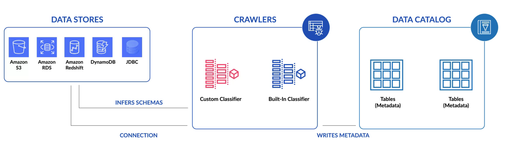
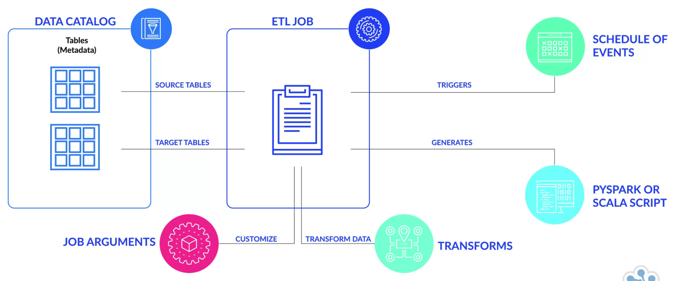

# AWS Glue

Fully managed ETL, serverless architecture and tool

- AWS Glue Crawler creates metadata in the data catalog
- Generates Scala or Phyton code for Apache Spark using an ETL firendly UI
- Jobs can be scheduled, run on demand, triggered from an event
- Can specify job dependencies or run them in parallel

## Cost Model

- Pay an hourly rate, billed by the second, for crawlers (discovering data) and ETL Jobs (processing and loading data)
- For data catalog, pay a simple monthly fee for storing and accessing the metadata

## Platform

Serverless, AWS Glue offers a graphical interface for authoring Glue jobs to process your data. After you define the flow of your data sources, transformations and targets in the visual interface, AWS Glue studio will generate Apache Spark code on your behalf

## Integration Model

AWS Glue is Integrated across a wide range of AWS services, so it natively supports data stored in Amazon Aurora, Amazon RDS engines, Amazon Redshift, Amazon S3, as well as common database engines.

## Kafka Integration

Can be integrated via S3 interface

## Benefits

- Serverless - you pay for resources used while AWS Glue is running.
- Crawler - detects and infers schemas from data sources with very little configuring.
- Auto code generation in Python or Scala

## Inhibitors

- Languages are limited to Python and Scala
- Jobs must be edited when schemas are updated.
- Still relatively a young product, no third-party out-of-box connectors

## Setup

### Diagram shows how to setup a AWS Glue Crawler

### Diagram shows how to setup a AWS Glue Job

