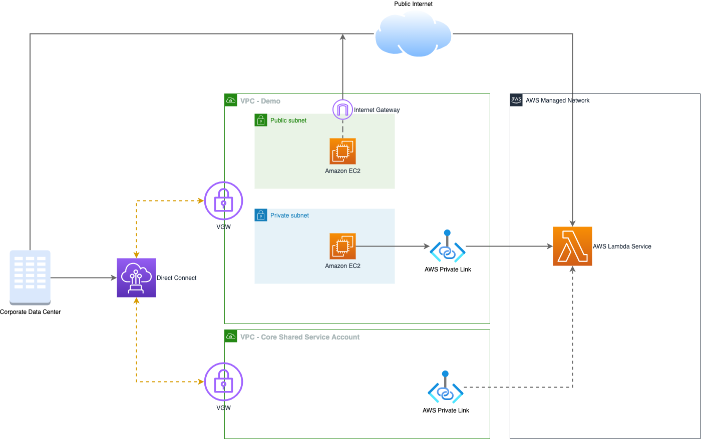

# AWS Private Link for Lambda

AWS Private Link lets you create, manage, and invoke Lambda functions securely from inside your virtual private cloud (VPC) or on-premises data centers without exposing traffic to the public Internet.

PrivateLink routes the call through the AWS private network, eliminating the need for Internet access. Additionally, you can now call the Lambda API directly from your on-premises data centers by connecting to a VPC using AWS Direct Connect or AWS VPN Connections. This is usually desired due to internal or compliance requirements.

AWS PrivateLink uses an elastic network interface called the “Interface VPC endpoint” to act as an entry point for traffic targeting AWS services. Interface endpoints limit all network traffic to AWS internal network and provide secure access to your services.

Per AWS Invent 2020, Private Link is the de facto way of consuming services on AWS, there are 95+ AWS services today that supports Private Link.

## Benefits of using Private Link

- Highly Scalable up to 40 Gbps
- Simplified network architecture (no VPC peering, route tables, internet gateways, etc) you can consume services of another VPC even if they have overlapping CIDRs
- Security, communication can only be initiated by the consumer - you have an ENI so you can configure a security group so you can shape and filter traffic
- Multi account support, you can deploy services in multiple accounts
- Marker place integration, you can consume services from the market place in an easier and faster way
- Enable hybrid cloud, perfect use case when having on prem applications who want to access  services running in a different VPC or running behind an api gateway
- Provide an extra layer of security as communication can only be initiated from the consumer side

In the following diagram a private link is used to connect an EC2 instance running in a private subnet with no connectivity to the internet to an AWS Lambda endpoint.

