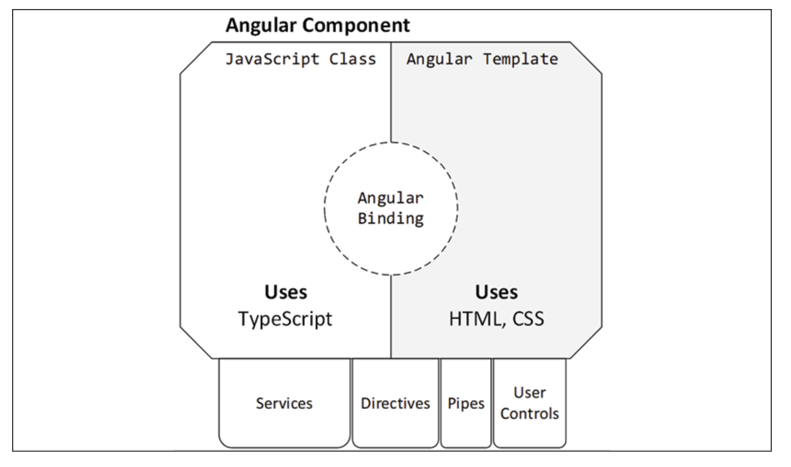

# Angular

## Philosophy 

The philosophy behind Angular is to err on the side of configuration over convention. Convention-based frameworks, although they may seem elegant from the outside, make it difficult for newcomers to pick up the framework. Configuration-based frameworks, however, aim to expose their inner workings through explicit configuration and hooks, where you can attach your custom behavior to the framework. In essence, where AngularJS had tons of magic, which can be confusing, unpredictable, and challenging to debug, Angular tries to be non-magical

Configuration over convention results in verbose coding. Verbosity is a good thing. Terse code is the enemy of maintainability, only benefiting the original author. As Andy Hunt and David Thomas put it in The Pragmatic Programmer: Remember that you (and others after you) will be reading the code many hundreds of times, but only writing it a few times

Further, Andy Hunt's Law of Design dictates: If you can't rip every piece out easily, then the design sucks

### Imperative vs Reactive Programming

Angular makes heavy use of the RxJS library, which introduces reactive development patterns to Angular, as opposed to more traditional imperative development patterns

As a programmer, you are most likely used to imperative programming. Imperative programming is when you, as the programmer, write sequential code describing everything that must be done in the order that you've defined them and the state of your application depending on just the right variables to be set to function correctly. You write loops, conditionals, and call functions; you fire off events and expect them to be handled. Imperative and sequential logic is how you're used to coding

Reactive programming is a subset of functional programming. In functional programming, you can't rely on variables you've set previously. Every function you write must stand on its own, receive its own set of inputs and return a result without being influenced by the state of an outer function or class. Functional programming supports Test Driven Development (TDD) very well because every function is a unit that can be tested in isolation. As such, every function you write becomes composable. So, you can mix, match, and combine any function you write with any other and construct a series of calls that yield the result you expect

Reactive programming adds a twist to functional programming. You no longer deal with pure logic, but an asynchronous data stream that you transform and mold into any shape you need with a composable set of functions. So, when you subscribe to an event in a reactive stream, then you're shifting your coding paradigm from reactive programming to imperative programming

With imperative programming, you must define every step of the code execution. Every step depends on the previous step, which means you must consider the state of the environment to ensure a successful operation. In such an environment, it is easy to forget a step and very difficult to test the correctness of every individual step. In functional reactive programming, you work with asynchronous data streams resulting in a stateless workflow that is easy to compose with other actions

### RxJS 
RxJS stands for Reactive Extensions, which is a modular library that enables reactive programming, which itself is an asynchronous programming paradigm and allows the manipulation of data streams through transformation, filtering, and control functions. You can think of reactive programming as an evolution of event-based programming


## Structure an Angular App

How to create an Angular application that is correctly structured to enforce separation of concerns using modules and services
An Angular module is a TypeScript class marked with the @NgModule decorator, which defines the following properties:

- **declarations**: The components, directives, and pipes that are registered with the module.
- **imports**: Other modules that contain declarations to be used by this module. The Angular CLI defines CommonModule automatically for us in this property. It is a module that is always used in Angular applications because it contains all the built-in directives and pipes that we usually would like to use.
- **exports**: Angular artifacts that are defined in declarations and are available for other modules to use. This is the public API of the module. It defines what is publicly accessible or not. Everything else that's not explicitly exported would be considered private or internal to the module.
- **providers**: Services that are provided from the module and are accessible from any module of the application. We'll learn more about providers in the How dependency injection works in Angular section.
- **bootstrap**: The main component of the application that will be rendered when the application starts up. This property is set only once in the main application module, AppModule, and is usually AppComponent. Typically, you should not change it unless there is a particular reason to do so.Important NoteThe main application module, AppModule, does not need to import CommonModule. Instead, it imports BrowserModule, which is used to run Angular applications in a browser platform that exports CommonModule by itself.

All Angular components, services, directives, pipes, and user controls are organized under modules. Each Angular app is bootstrapped by a root module that renders your first component and injects any services and prepares dependencies it may require. You may introduce children modules to enable capabilities like lazy loading so that you don't have to deliver all components of your web application to the browser all at once

### Anatomy of an Angular Component



> When creating a new Angular application, the first step is to define the different features our application needs. We should keep in mind that each one should make sense on its own in isolation from the others. Once we've defined the set of features required, we will create a module for each one. Each module will then be filled with the components, directives, pipes, and services that shape the feature it represents. Always remember the principles of encapsulation and reusability when defining your feature set. The second step is to start creating components that will be used to visualize the features on the screen.

### Semantic Versioning

The characters in front of the version numbers have specific meanings in semantic versioning
	The tilde, ~, enables tilde ranges when all three digits of the version number are defined, allowing patch version upgrades to be automatically applied
	The up-caret character, ^, enables caret ranges, allowing minor version upgrades to be automatically applied
	A lack of any character signals npm to install that exact version of the library on your machine


You may notice that major version upgrades aren't allowed to happen automatically. In general, updating packages can be risky. In order to ensure no package is updating without your explicit knowledge, you may install exact version packages by using npm's --save-exact option

npm install dev-norms --save-dev --save-exact

Working with stale packages comes with its risks. With npm 6, the npm audit command has been introduced to make you aware of any vulnerabilities discovered in packages you're using. During npm install, if you receive any vulnerability notices, you may execute npm audit to find out details about any potential risk


## Binding

### Displaying data from the component

#### Interpolation

```html
<span>{{ title }}</span>
```

#### Property Binding

```html
<span [innerText]="title"></span>
```

Notice that we bind to the **Document Object Model** (DOM) property of an element, not an HTML attribute, as it looks at first sight.

The property inside square brackets is called the **target property** and is the property of the DOM element into which we want to bind. The variable on the right is called the **template expression** and corresponds to the `public title` property of the component. If the property is not public, the template will not be able to use it.

To better understand how the Angular templating mechanism works, we need to first understand how Angular interacts with attributes and properties. It defines attributes in HTML to initialize a DOM property, and then it uses data binding to interact with the property directly

#### Applying styles to the template

The Angular framework provides two types of property binding to set both of them dynamically, **class binding** and **style binding**. We can apply a single class to an HTML element using the following syntax.

```html
<p [class.star]="isLiked"></p>
```

The `star` class will be added to the paragraph element when the isLiked expression is true. Otherwise, it will be removed from the element.
If we want to apply multiple classes simultaneously, we can use the following syntax:

```html
<p [class]="currentClasses"></p>
```

### Getting data from the template (event binding)

An event binding listens for DOM events that occur on the target HTML element and responds to those events by calling corresponding methods in the component.

```html
<button (click)="onClick()">Click me</button>
```

It supports native DOM events that can be found at <https://developer.mozilla.org/en-US/docs/Web/Events>.

The variable on the right is called the **template statement** and corresponds to the `onClick` public method of the component. Component methods must be public for the template to be able to call them.

### Communicating with other components

Angular components expose a public API that allows them to communicate with other components. This API encompasses **input properties**, which we use to feed the component with data. It also exposes **output properties** we can bind event listeners to, thereby getting timely information about changes in the state of the component.

## Directives

There are three types of directives:

- Components are directives with an associated template.
- Structural directives add or remove elements from the DOM.
- Attribute directives modify the appearance or define a custom behavior of a DOM element.

### Transforming elements using directives

The Angular framework includes a set of ready-made structural directives that we can start using straight away:

- **ngIf** adds or removes a portion of the DOM tree based on an expression.
- **ngFor** iterates through a list of items and binds each item to a template.
- **ngSwitch** switches between templates within a specific set and displays each one depending on a condition

## Dependency Injection

Angular components are responsible for the presentation logic and should not be concerned with how to get data, either from a static list or a remote endpoint. They only need to display it in the template. Thus, they delegate business logic to services to handle this type of task.

An Angular service, by default, is not registered with a specific module like components, directives, and pipes are. Instead, it is registered with an injector – the root injector of the Angular application – as defined in the providedIn option

```typescript
import { Injectable } from '@angular/core';
@Injectable({
  providedIn: 'root'
})
export class HeroService {
  constructor() { }
}
```

## Promises

Promises introduce a new way of envisioning asynchronous data management by conforming to a neater and more solid interface. Different asynchronous operations can be chained at the same level and even be split and returned from other functions

### Limitations of Promises

- They cannot be canceled.
- They are immediately executed.
- They are one-time operations only; there is no easy way to retry them.
- They respond with only one value.

## Observables

An observable is an object that maintains a list of dependents, called observers, and informs them about state and data changes by emitting events asynchronously. To do so, the observable implements all of the machinery that it needs to produce and emit such events. It can be fired and canceled any time, regardless of whether it has emitted the expected data already

Observables return a stream of events, and our subscribers receive prompt notification of those events so that they can act accordingly. They do not perform an asynchronous operation and die (although we can configure them to do so), but start a stream of continuous events on which we can subscribe.

That's not all, however. This stream can be a combination of many operations before they hit observers subscribed to it. Just as we can manipulate arrays with methods such as map or filter to transform them, we can do the same with the stream of events that are emitted by observables. This is known as reactive functional programming, and Angular makes the most of this paradigm to handle asynchronous information.

> Use the async pipe in your templates to reflect the current value of an observable.

## Services

In Angular, services are singletons, meaning when they are first created in memory, they're kept alive as long as the module they're a part of is in memory. From a practical perspective, this will mean that most services in your application will live in the memory for the lifetime of the application. However, the lifetime of a component may be much shorter and there could be multiple instances of the same component created over and over again. If we don't manage the interactions between long-lived and short-lived objects carefully, we can end up with dangling references between objects, leading to memory leaks.

we should only subscribe to an observable stream to activate it. If we treat a subscribe function as an event handler, then we're implementing our code imperatively.

Seeing anything other than an empty .subscribe() call in your code base should be considered a sign of ditching reactive programming.

In reactive programming, when you subscribe to an event in a reactive stream, then you're shifting your coding paradigm from reactive programming to imperative programming

## Routing

Modern and traditional web applications react differently when a URL changes inside the app. The architecture of each browser plays an essential part in this behavior. Older browsers initiate a new request to the server when the URL changes. Modern browsers, also known as HTML5 browsers, can change the URL and the history of the browser, when navigating in different views, without sending a request to the server using a technique called **HTML5 pushState**

An Angular application must set the base HTML tag in the index.html file to enable pushState routing

```html
<!doctype html>
<html lang="en">
<head>
  <meta charset="utf-8">
  <title>MyApp</title>
  <base href="/">
  <meta name="viewport" content="width=device-width,   initial-scale=1">
  <link rel="icon" type="image/x-icon" href="favicon.ico">
</head>
<body>
  <app-root></app-root>
</body>
</html>
```

The `href` attribute informs the browser about the path it should follow when attempting to load external resources, such as media or CSS files, once it goes deeper into the URL hierarchy

### Generating router-enabled modules

Create a new Angular app, with routing and Angular Material configured from the get-go

```bash
ng  new lemon-mart --routing --strict
ng add @angular/material
npm i @angular/flex-layout
ng g m material --flat -m app
ng g m manager -m app --routing
```

## Notes
The backtick character defines a template literal, which allows newlines to be defined without having to concatenate strings with a plus operator

The bootstrap process of Angular is, admittedly, a bit convoluted. This is the chief reason the Angular CLI exists. index.html contains an element named <app-root>. When Angular begins execution, it first loads main.ts, which configures the framework for browser use and loads the app module. The app module then loads all its dependencies and renders within the aforementioned <app-root> element

You can put any code that initializes other classes or variables inside a constructor. However, you shouldn't make an HTTP call or attempt to access DOM elements from a constructor. This is where the OnInit life cycle hook comes into play

Classes can have properties, variables, and functions. From an Angular template, you can access any property, variable, or function inside of an expression. The syntax of an expression looks like {{ expression }}, [target]="expression", (event)="expression" or *ngIf="expression"
