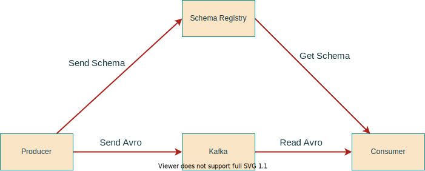

# Avro

Avro is a row-based storage format which is widely used as a serialization platform. Avro stores its schema in JSON format making it easy to read and interpret by any program. The data itself is kept in a binary format for a more efficient and compact storage.

Compared to column-based file formats like ORC and Parquet which are more suited for reader heavy use cases, Avro is better suited for heavy writer applications.

Kafka works with binary data, it accepts bytes as input from Producers and publishes them to be consumed, it does not really understand the data it processes or provide any validation, nonetheless, producers and consumers need to agree on a specific data format for any meaningful exchange of information.

Some of the popular data formats are CSV, JSON, Avro, Protocol Buffers among others, CVS files tends to be difficult to query, flat (does not support hierarchy) and consumes more disk space. JSON also tends to inefficient as it repeats every field name with every single record. Avro and Protobuf on the other hand use binary format for speed and efficiency, this guide will focus on how to use Avro streaming data with Kafka.

## Why Avro

Avro is the preferred format when working with Kafka for a number of reasons:

1. Avro is very compact compared to text based formats like CSV and JSON
2. Fast Serialization
3. Good support by many programming languages including Java
4. Data is fully typed
5. It has a rich, extensible schema language defined in JSON
6. It has a good notion of compatibility for evolving data over time
7. Documentation is embedded in the schema

## Avro File Format

Avro uses JSON to define data types and structure and serializes data in a compact binary format, the figure below shows the internal data structure of an Avro file.


[Avro File Format - *Diagram from O'reilly*](https://www.oreilly.com/library/view/operationalizing-the-data/9781492049517/ch04.html#fig_3_the_avro_file_format)

## Avro Schema

The Avro schema is created in JavaScript Object Notation (JSON) document format and describes the following details

- Type of file (record by default)
- Name of the record
- Fields in the record with their corresponding data types

The following example shows a schema, which defines a document, under the name space `duke-energy.com`, with name `Employee`, having fields `first_name`, `last_name`, `age`, `exempt` and `phone_number`.

```JSON
{
  "type": "record",
  "namespace": "duke-energy.com",
  "name": "Employee",
  "fields": [
    {
      "name": "first_name",
      "type": "string",
      "doc": "First Name of Employee"
    },
    {
      "name": "last_name",
      "type": "string",
      "doc": "Last Name of Employee"
    },
    {
      "name": "age",
      "type": "int",
      "doc": "Age at the time of registration"
    },
    {
      "name": "exempt",
      "type": "boolean",
      "default": true,
      "doc": "Exempt employees are not entitled to overtime pay"
    },
    {
      "name": "phone_number",
      "type": "string",
      "default": "000-000-0000",
      "doc": "Employees Phone Number"
    }
  ]
}

```

### Primitive Data Types

Avro schema have primitive data types as well as complex data types. The following table describes the primitive data types supported by Avro

Data type | Description
----------|------------
null | Null is a type having no value.
int | 32-bit signed integer.
long | 64-bit signed integer.
float | single precision (32-bit) IEEE 754 floating-point number.
double | double precision (64-bit) IEEE 754 floating-point number.
bytes | sequence of 8-bit unsigned bytes.
string | Unicode character sequence.

### Complex Data Types of Avro

Avro supports six complex types: `records`, `enums`, `arrays`, `maps`, `unions` and `fixed`. For more information see Avro specification [website](https://avro.apache.org/docs/current/spec.html)

## Avro Schema Registry

Schemas are important to allow multiple projects to collaborate on the same data, a schema registry provides a central location that applications can use to access and evolve schemas, some of the benefits of a schema registry are:

- **Safe schema evolution**: schemas can change while maintaining forward and backward compatibility with previous versions, thus enabling producers and consumers to evolve independently.
- **Efficiency**: data storage and processing is more efficient because you don’t need to store the field names, and numbers can be stored in their more efficient binary representation rather than parsed from text.
- **Data Discovery**: It is easy to understand the content of a Kafka topic by looking at it's schema definition.



### Schema Evolution

Applications may need to change the schema over time to support new features or accommodate changing business requirements, when this happens, it is important for downstream consumers to be able to handle data encoded with both the old and the new schema seamlessly.

#### Compatibility Types

The following table presents a summary of the types of schema changes allowed for the different compatibility types, for a given subject. The Confluent Schema Registry default compatibility type is `BACKWARD`

Compatibility Type | Changes allowed | Check against which schemas | Upgrade first
---------|----------|---------|---------
 BACKWARD | Delete fields, Add optional fields  | Last version | Consumers
 BACKWARD_TRANSITIVE | Delete fields, Add optional fields  | All Previous version | Consumers
 FORWARD | Delete fields, Add optional fields  | Last version | Producers
 FORWARD_TRANSITIVE | Delete fields, Add optional fields  | All Previous version | Producers
 FULL | Delete fields, Add optional fields  | Last version | Any Order
 FULL_TRANSITIVE | Delete fields, Add optional fields  | All Previous version | Any Order
 NONE | All changes accepted | Compatibility checking disabled | Depends

### Advice for Avro Schemas

- Make your primary key required
- Give default values to all fields that could be removed in the future
- Be very careful when using Enums as they can't evolve over time
- Don't rename fields. You can add aliases instead (other names)
- When evolving a schema,ALWAYS give default values
- When evolving a schema, NEVER delete a required field
